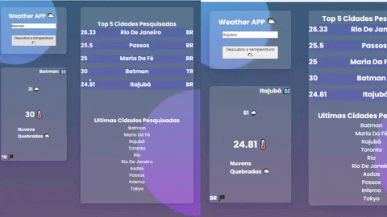

# WeatherAPI

<h4>Um sistema nodejs que tem como funcionalidade fazer buscas na api proporcionada pelo <a href="https://openweathermap.org/">openweathermap</a></h4>

## Conteúdo
* [Informações](#informações)
* [Tecnologias](#tecnologias)
* [Como Rodar](#Rodando)
* [Próximos Passos](#PróximosPassos )

## Informações
:green_book:
Esse projeto foi feito sem frameworks pois eram opcionais no teste, com o banco de dados postgreSQL,
e seu backend configurado em nodejs. 

## Tecnologias

:computer: Projeto foi criado utilizando:
* Node Version: 14.15.4
* Axios version: 0.21.1
* SweetAlert version: 10.0.2
* Google Fonts
* Postgres version: 13
* Handlebars: 4.7.7
* Socket-io: 4.0.1

## Rodando
:ferris_wheel: 
1- Para rodar o projeto, baixe a pasta do git.

2- Rode npm update.

3- Use Restore para "restaurar" o arquivo backup.sql no banco de dados Postgre

4- Renomeie o arquivo empty.env para .env apenas, e troque as credenciais
pelas suas dentro do arquivo.

5- Rode o programa utilizando nodemon app.js ou npm start(node app.js) 

## PróximosPassos 
:bug: 
1- Ajeitar o css do top-five. Pois este está descentralizado 

2- Usar o docker e o heroku para fazer um deploy.

3- Adicionar uma introdução ao app.

## TASKS

1- Uma página com dois paineis(esq direita): OK

2- Painel a esquerda(Busca e informações): OK

3- Painel a direita: informaçoes referentes ao histórico
em tempo real. Top 5 e ultimas pesquisas: OK

4- Operações de busca com AXIOS: OK

5- Nodejs e postgresql: OK

 
